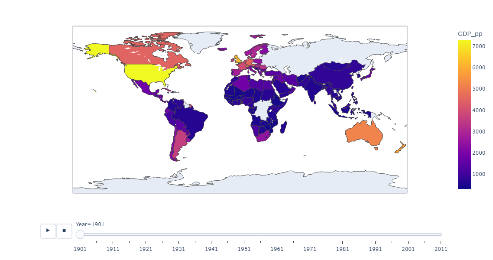

# Obesity vs GDP 📝

Two datasets with different information, one with Obesity and the other with GDP data  
In this project, the objective is to clean and understand both data, verifying at the end if they're related  
Just remember: relation doesn't mean cause and consequence  

Click on the [Jupyter Notebook](https://github.com/marco-rocha97/obesity-gdp/blob/main/obesity-gdp.ipynb) and watch the step-by-step of this project

Dataset Links:
1. [Obesity Among Adults by Country (1975-2016)](https://www.kaggle.com/amanarora/obesity-among-adults-by-country-19752016/)
2. [GDP per Person (1901-2011)](https://www.kaggle.com/divyansh22/gdp-per-person-19012011?select=GDP.csv)
